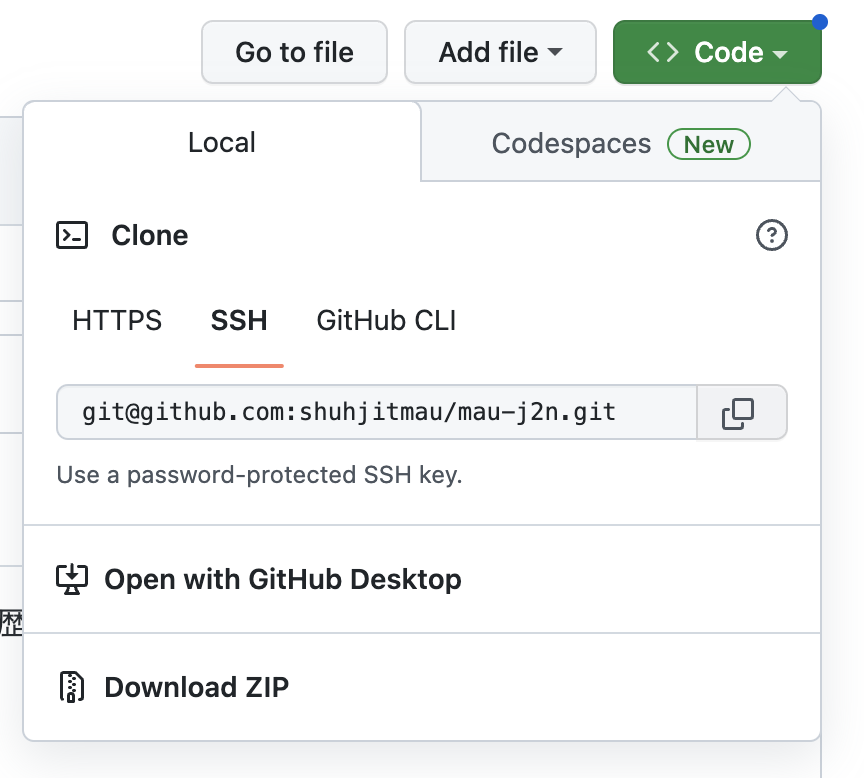
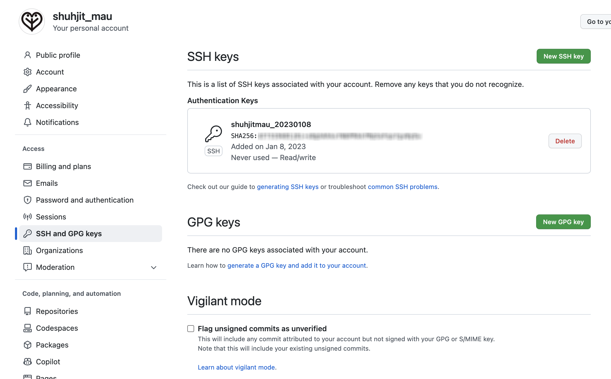

# Gitとは

Gitは、開発者間で記述したプログラムのソースコードの変更履歴を記録・追跡することができる分散型バージョン管理システムである。Gitを利用することによって、

 - ファイルの変更履歴管理
 - 過去のファイルに戻す
 - 編集した履歴を複数人で共有
 - オフラインでのプログラムの編集

などが可能になる。

今までのバージョン管理システムは、サーバーにあるリポジトリ内のファイルを開発者が共同で使用してたが、この場合開発者が増えた際に複数で同じファイルを編集し、先に編集した人の変更内容が消えてしまうような状況が起きる事がり、整合性を維持する事が難しかった。

Git最大の特徴は「分散型」である事であり、ワーキングディレクトリに各開発者の全履歴を含んだリポジトリの完全な複製が作られオフラインでも履歴の調査や変更の記録といったほとんどの作業を行うことが可能であるため、Gitはテキストデータの変更履歴を管理することが得意な事からプログラミングによるシステム開発だけではなくWebデザインなどでも使用されている。

# gitインストール
ターミナルから、下記のコマンドを実行。

 `` git --version `` 

以前、gitはインストールを行っていたが、実行したところ下記のエラーが表示された。

`` xcrun: error: invalid active developer path (/Library/Developer/CommandLineTools), missing xcrun at: /Library/Developer/CommandLineTools/usr/bin/xcrun ``

原因を調査したところ、OSのバージョンアップを行った場合、このエラーが出ることがあるとあったので、再度「Xcode Command Line Tool」のインストールを実施。

`` xcode-select --install ``

インストール後、ターミナルから、下記のコマンドを実行。

 `` git --version `` 

``git version 2.37.1 (Apple Git-137.1)``

が表示されたので、インストールの完了を確認。

#　gitセットアップ

Gitにユーザー名とメールアドレスを設定することで、コミットしたときに誰が行なったコミットかを記録することが可能。

``git config --global user.name "shuhjitmau"``

``git config --global user.email "shuhjit.mau@gmail.com"``

ユーザー名とメールアドレスが設定できたかは、下記のコマンドで確認可能。

``git config user.name``

``git config user.email``

ターミナルからGitで管理するディレクトリを作成し、ディレクトリに移動する。

``mkdir mau-j2n``  

``cd mau-j2n``

そのフォルダをGitで管理できるように、以下のコマンドを実行。

``git init``

問題がなかった場合、下記のような実行結果が出る。

現在のブランチ名をmainに変更するため、コマンドを実行。

``git branch -M main``

GitHubの作成したリポジトリ画面を開き、「HTTPS/SSH」と書かれたボタンの「SSH」を押し、”git@github.com:shuhjitmau/mau-j2n.git”をコピーする。

（リポジトリ画面の「Code」の中のSSHを選択しても良い）

コピー後、以下のコマンドをターミナルで実行しpush先のリモートリポジトリを指定する。

``git remote add origin git@github.com:shuhjitmau/mau-j2n.git``

以下コマンドを実行すると、登録されているリモートリポジトリを確認することが可能。

``git remote -v``

# GitHubとは

GitHubは、GitHubはGitの仕組みを応用し、Web上でソースコードのバージョン管理と公開を可能としたサービスで、ユーザーがプログラムのソースコードやデザインデータなどを保存、公開できるようにしたウェブサービスの名称。「Git」の「ハブ：拠点・中心・集まり」という意味で、GitHub社が運営しており、

 - ソースコードのバージョン管理
 - ソースコードの共有・公開
 - プロジェクト管理・コミュニケーション

などを行う事ができる。

GitHubに作成されたリポジトリは、基本はパブリック設定ですべて公開されるが、有料サービスを利用するとアクセス制限のあるプライベートなレポジトリを作る事が可能になる。また、各プロジェクトにwikiやタスク管理ツールなど、グループ開発の為の機能も充実しているのが特徴である。

# Markdownとは

Markdown（マークダウン）は、書を記述するための軽量マークアップ言語（シンプルなテキストエディタを使っての入力が容易になるように設計された、簡潔な文法をもつマークアップ言語）のひとつで、

 - 手軽に文章構造を明示できる
 - 簡単で、覚えやすい
 - 読み書きに特別なアプリを必要としない
 - 対応アプリを使えば快適に読み書きできる

などの特徴がある。

Markdownはシンプルな記法で文章に装飾を反映させると同時に構造化できる事ができ、レイアウトやスタイルを意識せず、文章を考えることだけに集中する事ができる点がメリットである。例えば見出しは「# 見出し」のように「#」+「半角スペース」で書き、「#」の数で見出しを５段階で表現することができる。

#　GitHubアカウントの作成

「GitHubに登録する」ボタンを押し、アカウント登録画面へ
新規登録用のフォームに、ユーザー名、メールアドレス、パスワードを入力。
GitHubのアップデートやお知らせを受け取るかどうかに「yes」か「no」で回答。
登録者がロボットではないことを確認する質問がありますので、質問の通りに回答。

質問に正しく回答すると、登録したメールアドレス宛に認証コードが送られてくるので、
コードを入力。

##　リモートリポジトリの作成

Githubの画面左の「Create repository」ボタンもしくは、GitHubのヘッダー右上にある「+」をクリックして表示される項目の「New repository」をクリック。

「Repository name」の箇所にプロジェクト名「mau-j2n」と入力。
また、今回は公開設定の為、「Public」を選択。
その他の項目も必要に応じて入力し、リモートリポジトリを作成。

リモートリポジトリの作成が完了すると、下記のページが表示される。

##　GithubアカウントにSSHキーの追加

SSHで接続するのに必要なSSHキーを作成
`` ssh-keygen -t ed25519 -C "GitHubに登録したメールアドレス"`` 

「Enter a file in which to save the key」というメッセージが表示されたら、Enter キーを押します。 これにより、デフォルトのファイル場所が受け入れられます。 さらに「Enter passphrase(empty for no passphrase)」「Enter same passprase again」とパスワードの設定を求められるので入力。

SSHキーファイルに書かれた内容をコピー。
`` pbcopy < ~/.ssh/SSHキーファイル名.pub`` 

GitHubのヘッダー右上にあるプロフィール画像を押して、その中の「Settings（設定）」を押してください。

左側のサイドメニューから、「SSH and GPG keys.」を押してください。 

次に「New SSH Key」を押してください。

Title欄に任意の名前をつけてください。 Key欄に先ほどコピーした内容を貼り付けてください

##　SSH接続の確認
GitHubに接続ができるか確認をしてみましょう。
ssh -T git@github.com

あなたのユーザー名が表示されたら接続完了です。

一括登録
git add.
git commit

